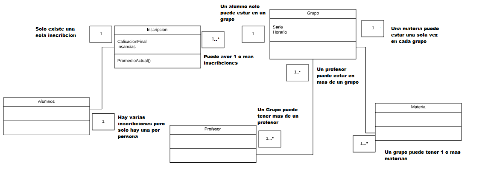
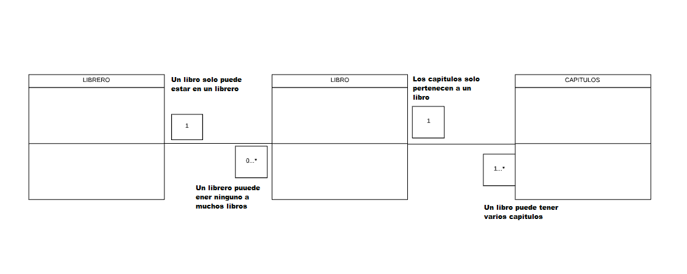
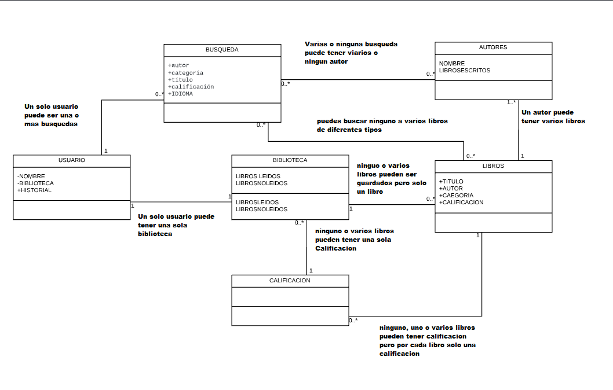

# UML 

1:Agrega la cardinalidad o multiplicidad para las asociaciones del siguiente diagrama de clases, justifica tus decisiones:

# 

2: Completa los tipos de asociación (Agregación y Composición) y multiplicidad que hay entre las clases siguientes y explica porque es de ese tipo.

# 

3:Haz el diagrama de clases del siguiente sistema:

