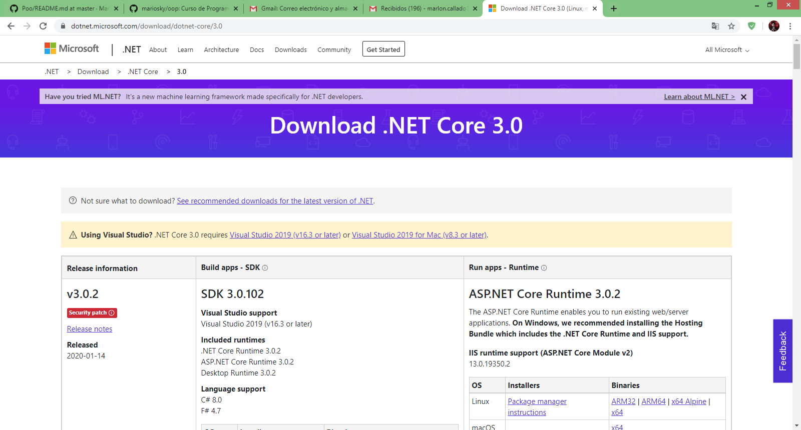

# Ejercicio de markdown

# Instalación de dotnet core 2.2.
Lo primero que tenemos que hacer es bajar el archivo de instalacion del siguiente [lugar](https://dotnet.microsoft.com/download/dotnet-core/3.0).
Es importante bajar el SDK porque **vamos a programar**.

La pagina se ve  asi:
.

# Instalación y configuración de Visual Studio Code para C#.

# Instalación de git. conectado a tu cuenta de GitHub y VSC.

